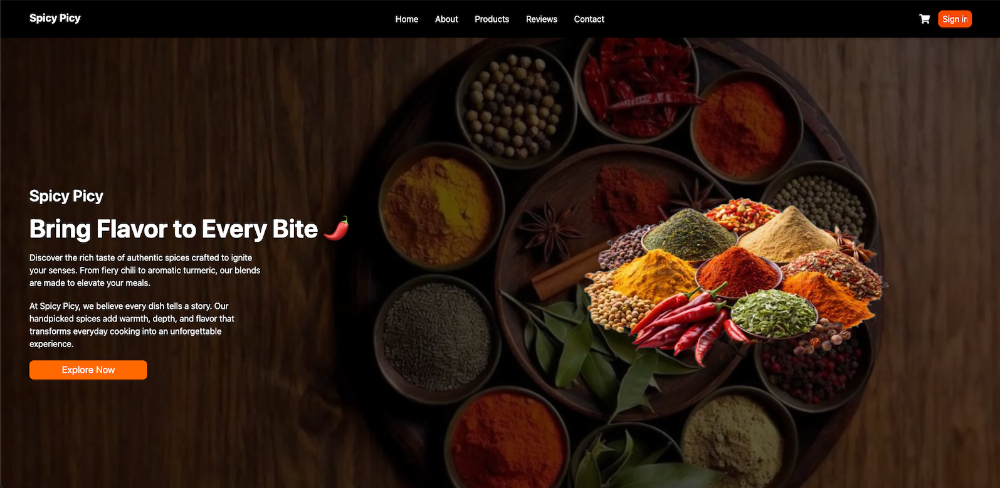

<div align="center">
    <a href="https://github.com/Itssanthoshhere/Spicy-Picy" target="_blank">
      
    </a>
  <br />

  <div>
    
    
    
    
  </div>

  <h3 align="center">🌶️ Spicy Picy: Landing Page</h3>
  <p align="center">A modern and responsive <b>Spicy Picy Landing Page</b> built with <b>React</b> and <b>Tailwind CSS</b>, featuring a Hero section, Banner, Products, About, Reviews, and Footer with smooth scrolling navigation.</p>

  <a href="https://spicy-picy.vercel.app/" target="_blank">
    
  </a>
  <br />
</div>

---

## 📋 Table of Contents

1. 🌟 [Introduction](#introduction)  
2. ⚙️ [Tech Stack](#tech-stack)  
3. 🔥 [Features](#features)  
4. 🚀 [Quick Start](#quick-start)   
5. 🔗 [Links](#links)  
6. 📞 [Contacts](#contacts)  

---

### <a name="introduction">🌟 Introduction</a>

**Spicy Picy** is a visually appealing, fully responsive landing page for a spice brand. It showcases products, highlights brand specialties, displays customer reviews, and provides a smooth scrolling experience for users.  

It includes:  
- Fixed **Navbar** with desktop and mobile support  
- **Hero** and **Banner** sections with call-to-action buttons  
- **About** and **Product** sections with interactive cards  
- **Reviews** section with randomized customer testimonials  
- **Footer** with contact info, links, and specialties  

---

### <a name="tech-stack">⚙️ Tech Stack</a>

- **[React](https://reactjs.org/)** – JavaScript library for building UI  
- **[Tailwind CSS](https://tailwindcss.com/)** – Utility-first CSS framework  
- **[Vite](https://vitejs.dev/)** – Build tool for fast development  
- **JavaScript (ES6)** – Modern frontend logic  

---

### <a name="features">🔥 Features</a>

- Fully responsive **desktop & mobile layout**  
- Smooth scrolling navigation for better UX  
- Interactive **Product and About cards** with hover effects  
- **Reviews section** showing random customer testimonials  
- Fixed **Navbar** that adapts while scrolling  
- Clean and modern **UI with Tailwind CSS**  
- Reusable React components for better code maintainability  

---

### <a name="quick-start">🚀 Quick Start</a>

#### **Prerequisites**
- [Node.js](https://nodejs.org/)  
- [npm](https://www.npmjs.com/)  

#### **Clone the Repository**
```bash
git clone https://github.com/Itssanthoshhere/Spicy-Picy.git
cd Spicy-Picy
````

#### **Install Dependencies**

```bash
npm install
```

#### **Run the Project**

```bash
npm run dev
```

Visit the app at:
👉 [http://localhost:5173](http://localhost:5173)

---

### <a name="links">🔗 Links</a>

* **GitHub Repository** → [https://github.com/Itssanthoshhere/Spicy-Picy](https://github.com/Itssanthoshhere/Spicy-Picy)
* **Live Demo** → [https://spicy-picy.vercel.app/](https://spicy-picy.vercel.app/)

---

### <a name="contacts">📞 Contacts</a>

👤 **Santhosh VS**

* GitHub: [Itssanthoshhere](https://github.com/Itssanthoshhere)
* LinkedIn: [Santhosh VS](https://www.linkedin.com/in/thesanthoshvs/)

---

#### ⭐ Show Your Support

If you liked this project, **give it a ⭐** and share it with others!

---
